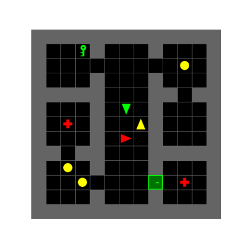
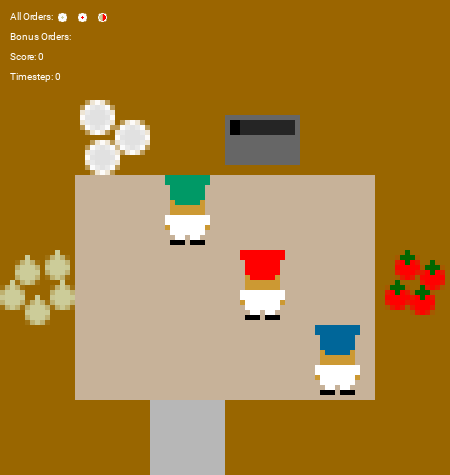
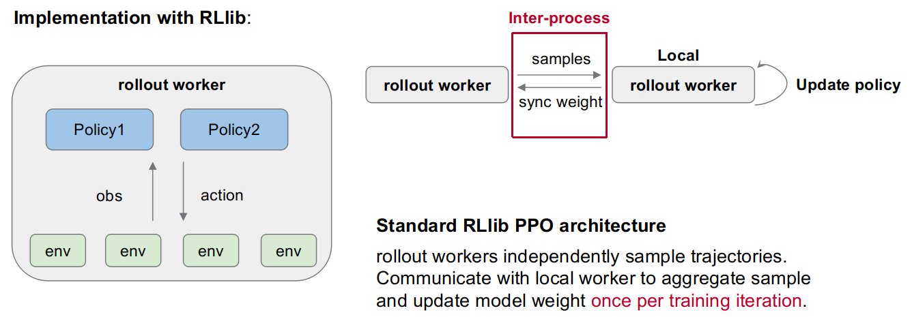

This repo contains codes for MARL in customized GridWorld-USAR and OvercookedAI environments based on Ray RLlib. Currently, it suppports training IPPO policies with $n \geq 2$ agents. MAPPO and QMix will be integrated later.

## Installation
1. Create new anaconda environment.
```bash
cd marl_rllib
conda env create -f marl_rllib.yml
```
2. Install the multigrid package locally and overcooked packages
```bash
conda activate marl_rllib
cd multigrid
pip install -e .
# install overcooked
pip install overcooked_ai
pip install dill
```
---
## Tasks

### GridWorld-USAR
Our GridWorld task is built from [gym-multigrid](https://github.com/ArnaudFickinger/gym-multigrid). The domain Urban Search and Rescue (USAR), is a task that requires a team of agents to remove rubbles and victims. The current demo 3-agent task is defined in `usar_game.py` as shown in the GIF below. Agents should heal all victims (red cross) and remove all rubbles (yellow circle), but one victim is blocked by a door, and the other is blocked by rubbles. Agents are heterogeneous and rewarded individually for removing rubble, opening the door and healing the victim.




### Overcooked-AI
The overcooked-ai task is built based on this [package](https://github.com/HumanCompatibleAI/overcooked_ai). Our implementation in `OvercookedEnv.py` supports training more than 3 agents with RLlib. Task is specified by layout files. One example onion and tomato soup task is shown in the GIF below. Agents should deliever a tomato soup, an onion soup, and a mixed soup at a pre-defined order. Agents will only receive reward after all 3 soups are completed correctly. Notice that the reward sparsity makes this task extremely difficult to learn.



---
## Example: train Overcooked
Training a 3 agent Overcooked task
```bash
bash train_overcooked.sh
```
`config` sets the config file we are using to run experiments. Now we are using `/config/overcooked_.yaml`. In the config file, hyper-parameters for the experiment are set, such as learning rate, batch size. Policy checkpoint frequency and total training environment steps should be specified to launch experiments.

The mode `tune` is used to create a ray experiment runner that can handle parallel sampling and training. To simplify for debugging, one can use mode `train`.

The current default training logging directory is `./data/experiment_name`, this can be modified in `train.py` as
```python
tune.run(
    get_trainer(),
    name = args.name,
    stop = {"timesteps_total":args.timesteps_total},#"training_iteration": args.stop_iters, },
    config = Config["BASE_CONFIG"],
    local_dir="Desired path", # Modify to the desired path
    verbose=3,                    # set to enable different extent of logging.
    checkpoint_freq=args.ckpt_freq,
    keep_checkpoints_num=5,
    checkpoint_at_end=True,
    restore = restore,
    callbacks = [CustomCheckpointCallback(args.model_path)]
)
```
---
## Implementation details
The core functions of training including policies, trainer, and callbacks are in `infrustracture`. `agent_policy.py` defines agent policies that generate actions to interact with environments and compute loss given samples. `agent_trainer.py` defines the on-policy training algorithm of PPO. `callbacks.py` handles some result logging process. The sampling and training process is handled by rllib workers, as shown in the illustration.



\
When configuring a Multi-Agent Reinforcement Learning (MARL) algorithm, each agent's observation space is defined within a dictionary where the keys are the agent IDs and the values are the corresponding observation space objects, allowing RLlib to differentiate and handle the unique observations for each agent in the environment. This is specified in the `multiagent` configuration in `train.py`, mapping each agent id to its specific policy and observation space.